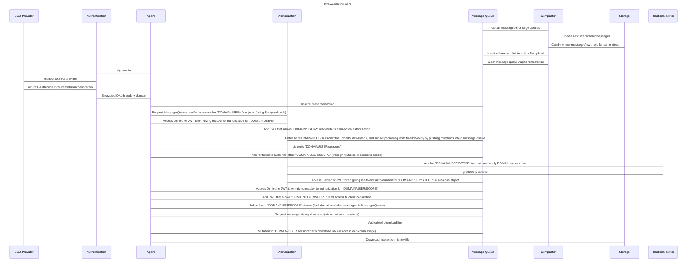

# Development

First install [docker](https://docs.docker.com/get-docker/),
[kind](https://kind.sigs.k8s.io/docs/user/quick-start), and
[skaffold](https://skaffold.dev/docs/install/); then you can:

```sh
# Run a local docker registry.
docker run -d -p 5000:5000 --restart=always --name registry registry:2

# Set up a local kind cluster and deploy the core application.
sh core/deploy.sh --setup
```
After the first run of the above command you may omit the
```--setup``` flag. Use it again any time to re-initialize the
cluster. Technically the ```sh core/deploy.sh``` script will
auto-reload servers on updates, but manually stopping it with
ctrl+c and re-running ```sh core/deploy.sh``` is often
faster.

> **_NOTE:_**<br>
> If docker/kind/something raises odd issues (we have seen
> network resolution instabilities at levels outside of this
> project's scope) just run ```sh core/deploy --setup.sh```
> again to refresh your local cluster.

# Deployment

Install [docker](https://docs.docker.com/get-docker/),
[skaffold](https://skaffold.dev/docs/install/), and
[gcloud](https://cloud.google.com/sdk/docs/install).

## GKE cluster

### Login

Use these commands to load required credentials into your
environment:

```sh
gcloud auth revoke
gcloud auth login web
gcloud config set project opensourcelearningplatform
gcloud container clusters get-credentials skaffold-deployed --region us-central1
```

Use these commands to switch kubectl to use the live project's
cluster:

```sh
kubectl config use-context gke_opensourcelearningplatform_us-central1_skaffold-deployed
kubectl config use-namespace production
```

### Deploy

#### Setup

```sh
# Install the gcloud gke-gcloud-auth-plugin component.
gcloud components install gke-gcloud-auth-plugin

# Load gcloud credentials.
gcloud container clusters get-credentials skaffold-deployed --region us-central1

# Set CORS config for production bucket.
gsutil cors set \
  core/infrastructure/production/CORS_CONFIG_FILE \
  gs://development-bucket-opensourcelearningplatform
```

#### Deploy to "staging" or "production"

```sh
# Deploy to GKE where $PROFILE=staging or production.
sh core/deploy.sh $PROFILE
```

# Sequence Diagram

