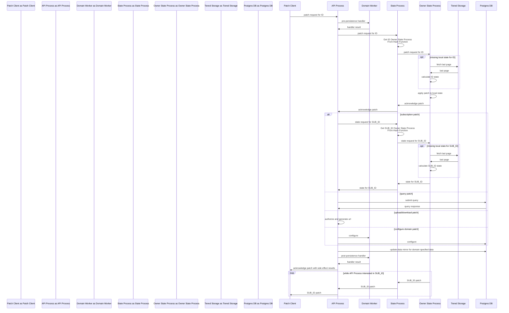

# Development

First install [docker](https://docs.docker.com/get-docker/),

```sh
# Run a local docker registry.
docker run -d -p 5000:5000 --restart=always --name registry registry:2

# Set up a local kind cluster and deploy the core application.
sh core/deploy.sh --setup

# Deployment

Install [docker](https://docs.docker.com/get-docker/),
[gcloud](https://cloud.google.com/sdk/docs/install).

## GKE cluster

### Login

Use these commands to load required credentials into your
environment:

```sh
gcloud auth revoke
gcloud auth login web
gcloud config set project opensourcelearningplatform
```

#### Setup

```sh
# Set CORS config for production bucket.
gsutil cors set \
  core/infrastructure/production/CORS_CONFIG_FILE \
  gs://development-bucket-opensourcelearningplatform
```

#### Deployment

```sh
sh core/infrastructure/GCP/publish.sh production
```

# Sequence Diagram

```mermaid
sequenceDiagram
  participant Patch Client as Patch Client
  participant API Process as API Process
  participant Domain Worker as Domain Worker
  participant State Process as State Process
  participant Owner State Process as Owner State Process
  participant Tiered Storage as Tiered Storage
  participant Postgres DB as Postgres DB

  Patch Client ->> API Process: patch request for ID
  API Process ->> Domain Worker: pre-persistence handler
  Domain Worker ->> API Process: handler result
  API Process ->> State Process: patch request for ID
  State Process ->> State Process: Get ID Owner State Process<br>From Hash Function
  State Process ->> Owner State Process: patch request for ID
  opt missing local state for ID
    Owner State Process ->> Tiered Storage: fetch last page
    Tiered Storage ->> Owner State Process: last page
    Owner State Process ->> Owner State Process: calculate ID state
  end
  Owner State Process ->> Owner State Process: apply patch to local state
  Owner State Process ->> State Process: acknowledge patch
  State Process ->> API Process: acknowledge patch
  alt subscription patch
    API Process ->> State Process: state request for SUB_ID
    State Process ->> State Process: Get SUB_ID Owner State Process<br>From Hash Function
    State Process ->> Owner State Process: state request for SUB_ID
    opt missing local state for SUB_ID
      Owner State Process ->> Tiered Storage: fetch last page
      Tiered Storage ->> Owner State Process: last page
      Owner State Process ->> Owner State Process: calculate SUB_ID state
    end
    Owner State Process ->> State Process: state for SUB_ID
    State Process ->> API Process: state for SUB_ID
  else query patch
    API Process ->> Postgres DB: submit query
    Postgres DB ->> API Process: query response
  else upload/download patch
    API Process ->> API Process: authorize and generate url
  else configure domain patch
    API Process ->> Domain Worker: configure
    API Process ->> Postgres DB: configure
  end
  API Process ->> Postgres DB: update data mirror for domain specfied data
  API Process ->> Domain Worker: post-persistence handler
  Domain Worker ->> API Process: handler result
  API Process ->> Patch Client: acknowledge patch with side effect results
  loop while API Process interested in SUB_ID
    Owner State Process ->> State Process: SUB_ID patch
    State Process ->> API Process: SUB_ID patch
    API Process ->> Patch Client: SUB_ID patch
  end
```

## State Process Spec

```
patch or state request for ID:
  use consistent hash function on ID to get X owner processes
  if current process not an owner process, route request to one of the owner processes
  else:
    if is state request and already tracking, return state
    else, start tracking:
      ensure connections to majority of other owner processes
      if no leader for ID established:
        attempt to become leader
           use given list of owners from active consistent hash function
           contact other ID owners with call for vote with incremented election cycle index
           if more than half agree, become leader
             (keep acting as leader as long as can stay connected to majority of owners)
           if more than half share other leader:
             accept that leader
             (keep leader in memory and track ID as long as leader maintains connection)
           if less than half are reachable:
             return that I should be ignored as an owner
      if current process not leader:
        forward request to leader (if patch request, specify that should return state after patch)
        remember ID state
        start tracking ID state updates by applying future forwarded patches from leader
      else:
        if no current state calculated yet:
          attempt to sync current state from last leader
          if syncing from last leader not possible:
            pull all previous leader patch files from cold storage for patches for ID
            pull most recent ID specific patch files from cold storage
            calculate current state:
              if interaction index gap between ID specific patch files and leader patch files:
                log this issue
                treat ID specific patch file as authoritative
              if interaction patches from leader files don't agree, patches from most recent leader win
        if is patch request:
          if interaction index ahead of current state's + 1:
            respond to patching client with request to replay patches
          if interaction index below current'states + 1:
            notify client that it is out of sync
          else:
            if not out of sync:
              apply to current state
              send patch to all other ID owners that have expressed interest
            save patch to leader interaction patch file:
              bundle patches in bulk
              write to cold storage
              acknowledge for patching client (unless out of sync)
```